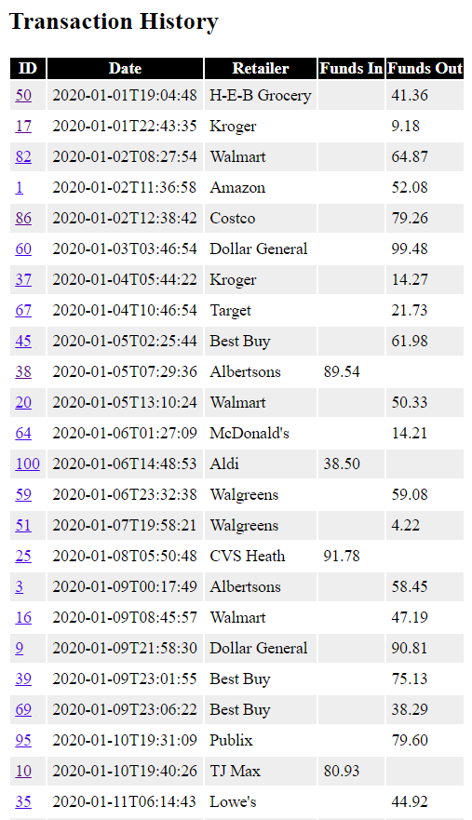
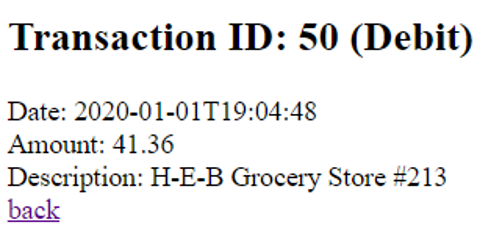

Assignment #11

Your job in this assignment will be to make an online banking account history viewer.

Note: When you check-out the GitHub Repo (via https://github.com/tp02ga/java-bootcamp/tree/week15-11/Assignment11) you will notice that within the TransactionRepository, it has code to populate a List of Transactions with data when the Repository is created on startup.

I’d recommend checking out the code onto your local machine and booting up the application right away, and navigating to http://localhost:8080/transactions to see a static example of the page. You’ll notice that the table has four transactions “hard-coded” into it for demonstration purposes.

Given that your TransactionRepository will be populated with data automatically, your next task is to create two webpages via the following URLs:

    http://localhost:8080/transactions
    http://localhost:8080/transactions/{transactionId}

The first page will be used to view all 100 transactions that are stored in your repository.

Here’s an example of the output that you’ll need to create:

Note: You will need to list the transactions in sorted ascending order (by date).

You should also note that the IDs for each transaction is clickable. When one of them is clicked it will navigate to the second URL (mentioned above).

Here’s what the second webpage should look like when you click on Transaction ID 50:

Here’s another example of what the second webpage should look like when you click on Transaction ID 38:

Be sure to use proper design principles when creating your code.

You should have a Controller, a Service and a Repository with properly named methods (just as we’ve seen in this week’s lessons).